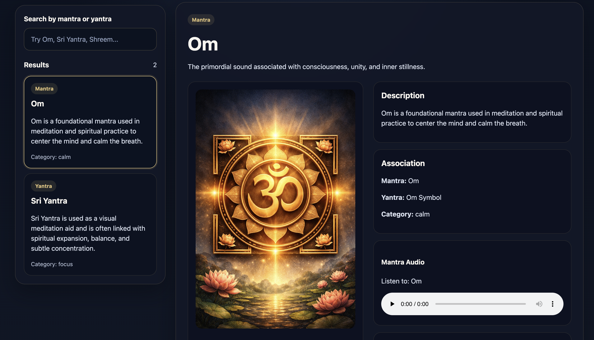

# TriMystra

A React + TypeScript app where users can search for a mantra or yantra and view:
- a yantra image
- mantra audio
- breathing guidance
- meaning and symbolism

## Tech stack
- React
- TypeScript
- Vite
- CSS

## Run locally in VS Code

### 1. Open terminal in the project folder
```bash
npm install
npm run dev
```

### 2. Open the local URL
```bash
http://localhost:5173/
```

### 3. Open the link to checkout the app




